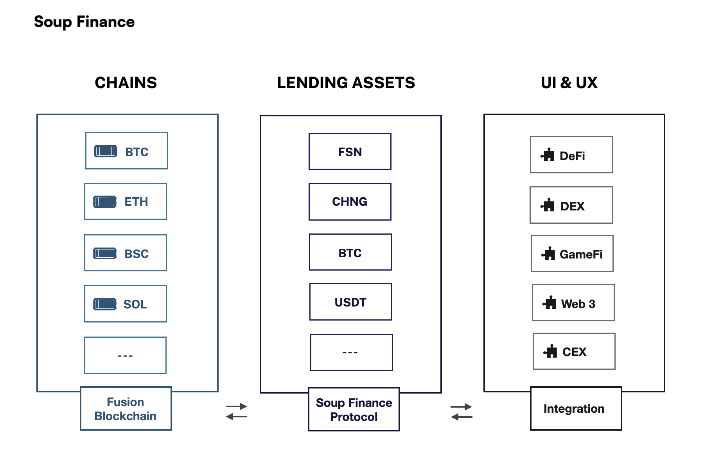

# Soup Finance

### Что такое Soup Finance?

Soup Finance - это протокол открытого кредитования, созданный с кросс-цепной функциональностью, выдачей займов в различных токенах с различным обеспечением, а также с алгоритмической оценкой рисков. Протокол позволяет демонстрировать эффективность капитала, используя криптовалюты и помогает сберечь деньги и время.

### Что делает Soup Finance уникальным?

| Большинство кредитных протоколов работают на встроенной криптовалюте в то время, как некоторые переходят на много цепочные  и изолированные пулы. Хоть они и необходимы, они очень далеки от настоящего DeFi потенциала. Много-цепочные и изолированные пулы не демонстрируют эффективность капитала. Неудачный пользовательский опыт от массового использования и устранение токенов подвергают риску атак типа вирусов червей  всех пользователей. |
| ---------------------------------------------------------------------------------------------------------------------------------------------------------------------------------------------------------------------------------------------------------------------------------------------------------------------------------------------------------------------------------------------------------------------------------------------------- |
| В отличии от других протоколов кредитования, Soup Finance использует рынок меж цепочных валют без мостов с долгосрочной устойчивой токеномикой. Пользователи могут беспрепятственно поставлять и брать в кредит активы из  общественных цепей за секунды, что способствует увеличению капитала, повышению безопасности и функциональности.                                                                                                           |

<figure><figcaption></figcaption></figure>

Soup Finance работает при поддержке блокчейн-платформы Fusion. Его цель сделать кредитование DeFi массовым, предоставляя инфраструктуру, которая упрощает взаимодействия с протоколом Soup Finance, а также простой в использовании интерфейс.

### C Soup Finance Вы можете:

* Зарабатывать проценты на любых токенах
* Брать кредит под залог любых токенов в качестве обеспечения
* Брать кредит под залог позицию автоматического маркет-мейкера и поставщика ликвидности в качестве обеспечения
* Использовать как кредитное плечо на долгий и короткий срок любой токен
* Зарабатывать SOUP токены
* Зарабатывать комиссию от платформы\
