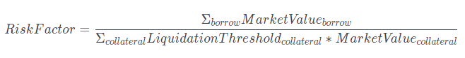

# Ликвидация

Ликвидация происходит, когда общая сумма займа пользователя достигает порогового значения, то есть фактор риска больше или равен 100%.

<figure><figcaption></figcaption></figure>

Мы рассчитываем этот порог ликвидации на основе средневзвешенного значения всех депонированных вами активов. После ликвидации новая сумма кредита заемщика будет сброшена, чтобы соответствовать «максимальной LTV» на основе существующей суммы залога до аукциона.
