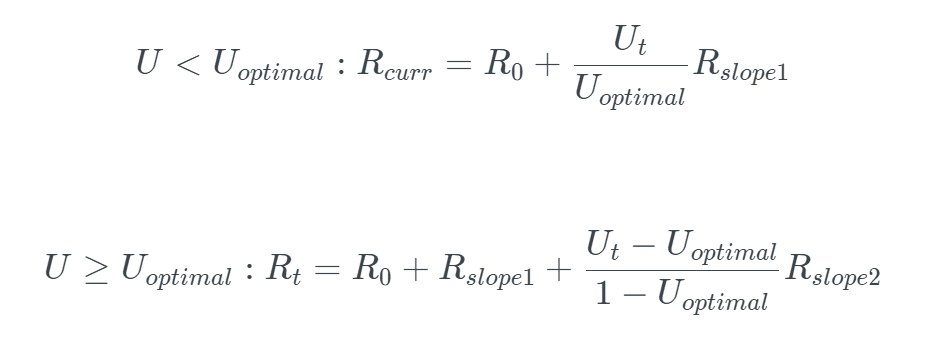

# Модель процентной ставки

Процентные ставки делятся на две категории: ставки заемщика и ставки заимодавца. Ставки заимодавца — это годовые ставки, выплачиваемые заимодавцам, в то время как процентные ставки заемщиков – годовые процентные ставки, выплачиваемые заемщиками.

<figure><figcaption></figcaption></figure>
